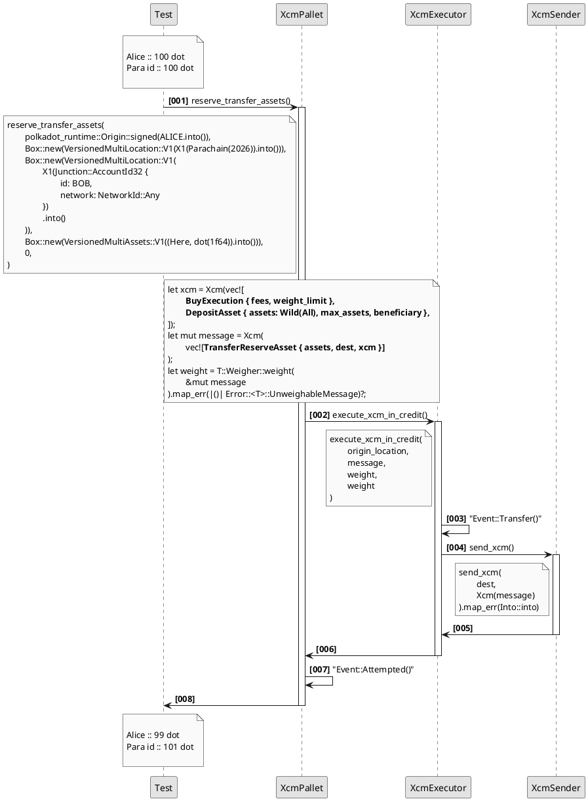
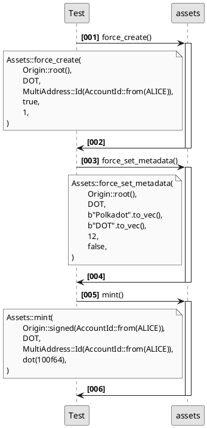
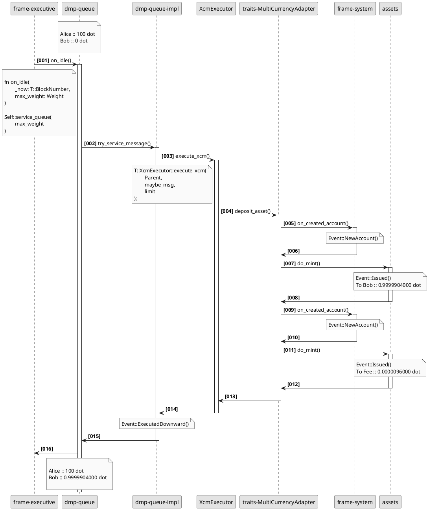
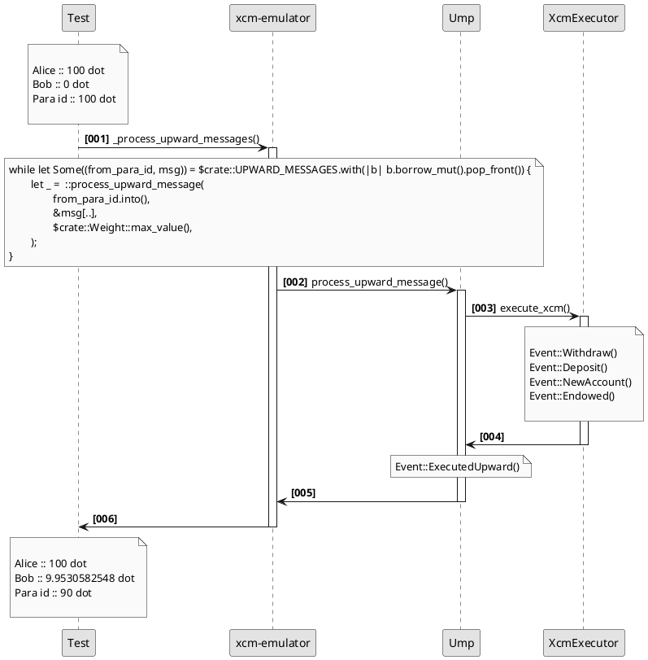
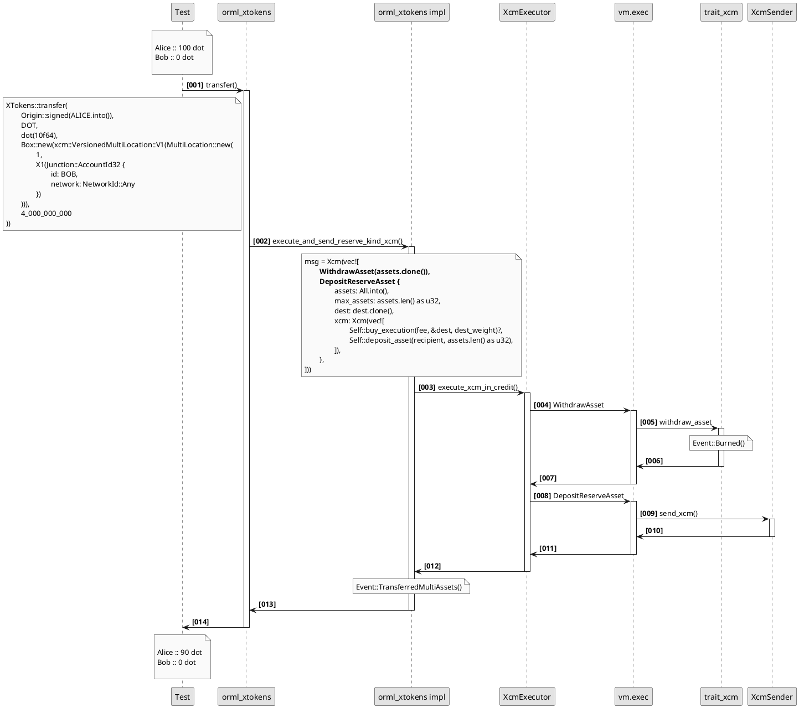

## UC-01 | Relaychain to Parachain

### Relay Chain Side

**genesis**

| Acc | balances |
| --- | --- |
| AccountId::from(ALICE) | dot(100f64) |
| ParaId::from(2026 as u32).into_account() | dot(100f64) |

**Extrincis Flow**

### parachain Side | NodleNet | 2026

**genesis**

**dmpqueue execution flow**

## UC-02 |  Parachain to Relachain

## Relay Chain Side

## parachain Side | NodleNet | 2026

